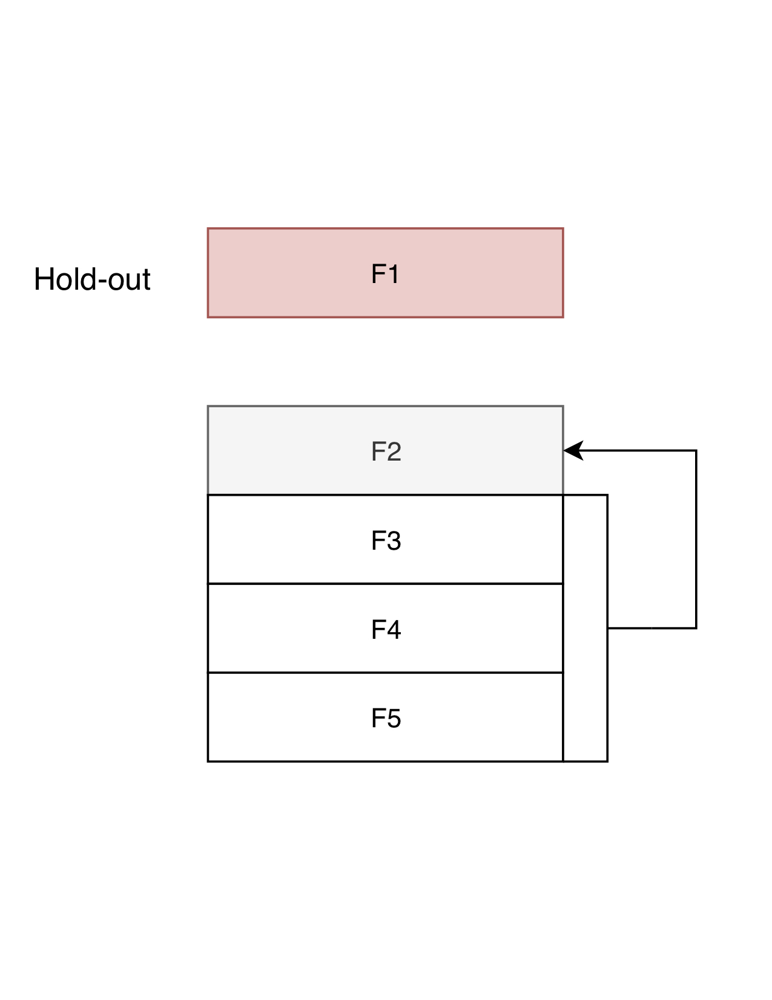
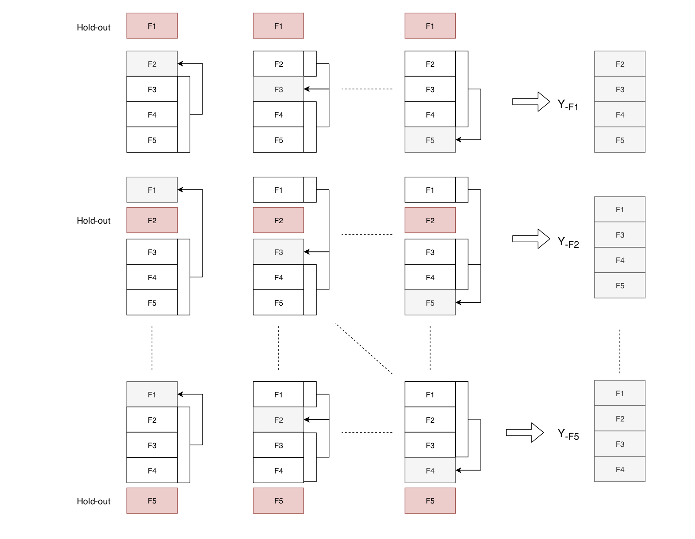

% Implementation Notes   
% Burak Himmetoglu
% January 5, 2019 

## Notation

The data is represented by the design matrix (a.k.a data matrix) ${\bf X} \in {\rm I\!R}^{N \times p}$ where
$N$ is the number of observations and $p$ is the number of features. For simplicity, we assume that 
the target vector ${\bf y} \in {\rm I\!R}^N$ represents a learning problem in the regression setting. 
All the the dicsussions below can be applied to the classification setting with appropriate modifications.

For stacking, the data is split over k-folds: $F_1, F_2, \dots, F_k$. Each $F_j$ represent the indices of the observations 
in the $j^{th}$ fold. Namely,

$$ X_{F_j} = X[F_j,:] $$

in a numpy-like notation. Negative indices $-F_j$ represent all the folds expect the $j^{th}$.

During fitting/training, the model parameters are optmized. We denote the folds over which the parameters are
optimized in subscripts. For example

$$ {\bf W}_{-F_i} $$

denotes that the weights ${\bf W}$ are optimized over all the folds expect the $i^{th}$ fold (this would be the case when the
regressor is a linear function of the data, i.e. $f({\bf X}) = {\bf W} \cdot {\bf X}$).

The figure below shows a single step in stacking: The fold $F_1$ is kept as hold-out, and the folds $F_3,F_4,F_5$ are used
for the fit. Predictions on the fold $F_2$ are obtained from the fitted model.

{height=25%, width=25%}

## Stacking a single model over k-folds

For illustration, we consider a case of 5-folds stacking procedure. There are 5 out-of-sample (OOS) predictions
that are to be stacked, where each fold is once kept as hold-out (HO).
In the illustrative linear regression model, the target vector ${\bf y}$ is
predicted by the linear function

$$ f(X) = {\bf X} \cdot  {\bf W} + {\bf b}$$

where ${\bf W} \in {\rm I\!R}^p$ and ${\bf b} \in {\rm I\!R}$. 
The optimal values of ${\bf W}, \, {\bf b}$ are obtained by minimizing the loss function:

$$ L({\bf W}, {\bf b}; \lambda) = ({\bf X} \cdot  {\bf W} + {\bf b} - {\bf y})^2 +  \lambda \vert {\bf W} \vert^2 \qquad , \qquad
   {\bf W}, {\bf b} \leftarrow {\rm argmin}_{W,b}\, L({\bf W}, {\bf b}; \lambda)
$$

where $\lambda$ is the hyper-parameter for the regularization term. In the initial implementation of stacking, 
we assume $\lambda$ to be a fixed parameter. 5 fits for ${\bf W}, {\bf b}$ are performed by minimizing
the loss function across folds and OOS predictions are collected. For instance, the OOS predictions for the splits
pictured above are obtained by

$$ {\hat y}^{OOS}_{-F_1} = 
\begin{bmatrix}
{\hat y}_{F_2} \\
{\hat y}_{F_3} \\
{\hat y}_{F_4} \\
{\hat y}_{F_5}
\end{bmatrix}
$$

where each ${\hat y}_{F_j}$ is a column vector whose length is equal to the number of observations in the $j^{th}$ fold.
In the above equation, ${\hat y}_{F_2}$ is obtained by optimizing the loss function on the data $X_{-(F_1+F_2)}$,
which results in ${\bf W}_{-(F_1+F_2)}, {\bf b}_{-(F_1+F_2)}$ and predicting on the fold $F_2$. Namely,

$$ {\hat y}_{F_2} = {\bf X}_{F_2} \cdot {\bf W}_{(-F_1+F_2)} + {\bf b}_{-(F_1+F_2)} $$
  
The rest of the predictions ${\hat y}_3, {\hat y}_4, {\hat y}_5$ are obtained following a similar set of computations. 
The predictions on the HO fold are instead obtained by simply fitting the model on all the four folds, and
predicting on the HO fold. Namely,

$$ {\hat y}^{HO}_{F_1} = {\bf X}_{F_1} \cdot {\bf W}_{-F_1} + {\bf b}_{-F_1} $$

Since the HO fold can be any of the 5 folds, we have the following set of OOS-HO predictions:

$$ \left[ ({\hat y}^{OOS}_{-F_1}, {\hat y}_{F_1}^{HO}), \dots, ({\hat y}^{OOS}_{-F_5}, {\hat y}_{F_5}^{HO}) \right] $$

As will be shown below, this set of OOS and HO predictions provide an automatic way to train the stacker models by 
5-folds cross-validation.

## Stacking multiple models over k folds

Suppose we have $M$ models that we would like to stack. For each model (assuming fixed hyper-parameters), 
we will repeat the above procedure to get OOS and HO predictions and construct new data matrices
by column-stacking. For example, when $F_1$ is the HO fold, we have

$$ {\bf X}^{OOS}_{-F_1} = 
\begin{bmatrix}
\vert & \dots & \vert \\
{\hat y}^{(1)\, OOS}_{-F_1} & \dots & {\hat y}^{(M)\, OOS}_{-F_1} \\ 
\vert & \dots & \vert 
\end{bmatrix}
\qquad, \qquad
{\bf X}^{HO}_{F_1} =
\begin{bmatrix}
\vert & \dots & \vert \\
{\hat y}_{F_1}^{(1)\, HO} & \dots & {\hat y}_{F_1}^{(M)\, HO} \\
\vert & \dots & \vert 
\end{bmatrix}
$$

Peforming the same for other HO folds, we end up with the following set of 5 pairs:

$$ \left[ ( {\bf X}^{OOS}_{-F_1}, {\bf X}_{F_1}^{HO}), \dots, ({\bf X}^{OOS}_{-F_5}, {\bf X}_{F_5}^{HO}) \right] $$

which can be used to train the stacker models by optimizing their hyper-parameters by 5-folds cross validation. 
The whole procedure of obtaining training/validation folds from OOS/HO pairs is decpicted in the figure below

{height=50%, width=50%}

Once the hyper-parameters of the stacker model are determined, the final predictions can be obtained. For the sake of 
simplicity, let's assume that the stacker is also a linear model. The stacker model uses the OOS predictions to train
and predict on the HO folds. The predictions on the first HO fold $F_1$ are obtained by 

$$ {\hat Y}_{F_1} = X^{HO}_{F_1} \cdot \Omega_{-F_1}+ \beta_{-F_1} $$

where $\Omega$ and $\beta$ are parameters of the stacker model optimized during fitting: 

$$ \Omega_{-F_1}, \beta_{-F_1} \leftarrow\, {\rm argmin}_{\Omega, \beta}\, 
    \left[ ( ({\bf X}^{OOS}_{-F_1} \cdot \Omega + \beta) - {\bf y}_{-F_1})^2 + \Lambda\, \vert \Omega \vert^2 \right]
$$

After performing the same set of computations for other HO folds and a grid of values for $\Lambda$,
we can train the stacker model. $\Lambda$ is determined across 5-folds by minimizing
the mean-squared-error (MSE) between ${\hat y}_{F_j}$ and ${\bf y}_{F_j}$ for $j=1,\dots,5$. 
More precisely, the value of $\Lambda$ is the one that results in the lowest average MSE across folds:

$$ \Lambda \leftarrow \, {\rm argmin}_{\Lambda} \left[ \sum_{i=1}^5\, ( {\bf y}_{F_i} - {\hat Y}_{F_i} )^2 \right]$$

Here ${\hat Y}_{F_i}$ has an implicit dependence on $\Lambda$ by the above equations.

## Final fit on training data

After the stacker model is trained (i.e. $\Lambda$ is determined), the final fit is obtained by using all the 5 folds
in $X^{OOS}$ instead of leaving one folds for HO. Namely,

$$ {\hat y}^{OOS} =
\begin{bmatrix}
{\hat y}_{F_1} \\
{\hat y}_{F_2} \\
{\hat y}_{F_3} \\
{\hat y}_{F_4} \\
{\hat y}_{F_5}
\end{bmatrix}
$$

where ${\hat y}_{F_i}$ is determined as follows:

$$ {\hat y}_{F_i} = {\bf X}_{F_i} \cdot {\bf W}_{-F_i} + {\bf b}_{-F_i} \qquad , \qquad
   {\bf W}_{-F_i}, {\bf b}_{-F_i} \leftarrow {\rm argmin}_{W,b} \left[ ({\bf X}_{-F_i} \cdot {\bf W}+ {\bf b} - {\bf y}_{-F_i})^2
      + \lambda \vert {\bf W} \vert^2 \right]
$$

Column-stacking theese column vectors for M models results in ${\bf X}^{OOS}$. With $\Lambda$ determined 
by the 5-fold cross validation procedure from above, the final predictions are provided by the stacker model:

$$ {\hat Y} = {\bf X}^{OOS} \cdot {\Omega} + \beta \qquad, \qquad
   \Omega, \beta \leftarrow {\rm argmin}_{\Omega, \beta} \ \left[ ({\bf X}^{OOS} \cdot \Omega + \beta - {\bf y})^2
      + \Lambda \vert \Omega \vert^2 \right]
$$

## Final fit on test data

The test data contains a completely new set of observations that need to go through the stacking procedure as well. 
In the first step, we also need to split the test data on 5-folds and 
predict using the 5 different sets of parameters ${\bf W}_{-F_i}, {\bf b}_{-F_i}$. Unlike the training
set where it is clear which fold is predicted by which model parameters (i.e. $F_1$ is predicted by 
the model that uses ${\bf W}_{-F_1}, {\bf b}_{-F_1}$), for the test set there is no natural
one-to-one correspondance. We therefore predict on each test fold by each model, resulting in a $5 \times 5$ 
set of predictions for **each model!**

Let's assume that we are stacking a single model's predictions. We construct the following matrix for this purpose:

$$
  {\bf Z}^{(1)} = 
\begin{bmatrix}
 {\bf X}^{\rm test}_{F_1} \cdot {\bf W}_{-F_1} + {\bf b}_{-F_1} & {\bf X}^{\rm test}_{F_1} \cdot {\bf W}_{-F_2} + {\bf b}_{-F_2} & \dots &
 {\bf X}^{\rm test}_{F_1} \cdot {\bf W}_{-F_5} + {\bf b}_{-F_5} \\
 {\bf X}^{\rm test}_{F_2} \cdot {\bf W}_{-F_1} + {\bf b}_{-F_1} & {\bf X}^{\rm test}_{F_2} \cdot {\bf W}_{-F_2} + {\bf b}_{-F_2} & \dots &
{\bf X}^{\rm test}_{F_2} \cdot {\bf W}_{-F_5} + {\bf b}_{-F_5} \\
\vdots & \vdots & \ddots & \vdots \\
{\bf X}^{\rm test}_{F_5} \cdot {\bf W}_{-F_1} + {\bf b}_{-F_1} & {\bf X}^{\rm test}_{F_5} \cdot {\bf W}_{-F_2} + {\bf b}_{-F_2} & \dots &
{\bf X}^{\rm test}_{F_5} \cdot {\bf W}_{-F_5} + {\bf b}_{-F_5}
\end{bmatrix}
$$

We need one column vector from ${\bf Z}^{(1)}$, which we choose to pick by taking the row averages:

$$
  {\hat y}^{\rm test, OOS} = \frac{1}{5}\, 
\begin{bmatrix}
\sum_{j}\, Z^{(1)}_{1j} \\
\vdots \\
\sum_{j}\, Z^{(1)}_{5j}
\end{bmatrix}
$$

Column-stacking the test OOS predictions into ${\bf X}^{\rm test, OOS}$ for $M$ models, we can then predict the test data using
the stacker model (with $\Omega, \beta$ determined from the training set).

## Training models to be stacked in addition to stacker

Up to this point we have assumed that the hyper-parameters ($\lambda$) of all the initial models are fixed.
This led to 5 models characterized by parameters ${\bf W}_{-F_i}, {\bf b}_{-F_i}$, for $i=1,\dots,5$. 
Instead, for each HO fold an internal 4-fold cross-validation can be performed to optimize the
hyper-parameters of each input model during training. While this procedure leads to an increased computational time, 
it usually results in better generalizability. This results in 5 fits per model with differing hyper-parameters.
